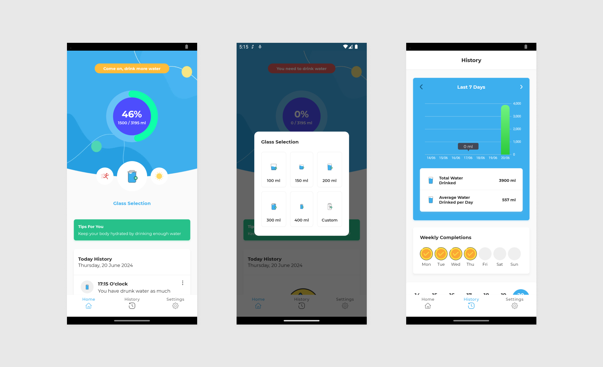

<h1 align="center">Minumin Water Reminder</h1>

<p align="center">  
🗡️ Minumin is the app that helps you to track your daily water intake 
</p>

<p align="center">

</p>

## How to clone
- If you are using https `git clone https://github.com/Codingle-House/Minumin.git`
- If you are using SSH `git clone git@github.com:Codingle-House/Minumin.git`

## Tech Stack and Library
- Minimum SDK level 21
- [Kotlin](https://kotlinlang.org/)
- Jetpack
  - Lifecycle: Observe Android lifecycles and handle UI states upon the lifecycle changes.
  - ViewModel: Manages UI-related data holder and lifecycle aware. Allows data to survive configuration changes such as screen rotations.
  - Room: Constructs Database by providing an abstraction layer over SQLite to allow fluent database access.
  - Proto Datastore: Data storage solution to save key-value pairs or typed object with [Protocol Buffer](https://protobuf.dev/)
  - [Hilt](https://dagger.dev/hilt/): for dependency injection.
- Architecture
  - MVVM Architecture (View - DataBinding - ViewModel - Model)
  - Repository Pattern
- Other Libraries
  - [MPAndroidChart](https://github.com/PhilJay/MPAndroidChart) -> For showing bar chart inside app
  - [SingleRowCalendar](https://github.com/misosvec/SingleRowCalendar) -> Showing horizontal recyclerview of calender
  - [EasyPermission](https://github.com/googlesamples/easypermissions) -> Easily manage android permission

```
Designed and developed by 2020 pertadima (Irfan Pertadima)

Licensed under the Apache License, Version 2.0 (the "License");
you may not use this file except in compliance with the License.
You may obtain a copy of the License at

   http://www.apache.org/licenses/LICENSE-2.0

Unless required by applicable law or agreed to in writing, software
distributed under the License is distributed on an "AS IS" BASIS,
WITHOUT WARRANTIES OR CONDITIONS OF ANY KIND, either express or implied.
See the License for the specific language governing permissions and
limitations under the License.
```


